<!-- animated contribution graph: real data, boxes reveal cell by cell
     (regenerated daily by .github/workflows/update-profile-art.yml) -->
<h3><code>antonio@github ~ $ ./contributions.sh</code></h3>

 
 

<!-- hero: monochrome ASCII portrait (types in) beside a neofetch-style info panel.
     widths 370 + 490 = 860 match the heatmap width above -->
<h3><code>antonio@github ~ $ whoami</code></h3>

<table>
<tr>
<td valign="top"></td>
<td valign="top"></td>
</tr>
</table>

 
 

<!-- spotify wrapper -->
<h3><code>antonio@github ~ $ ./spotify.sh</code></h3>

 
 

<!-- stack & technologies -->
<h3><code>antonio@github ~ $ ./stack.sh</code></h3>

  <b>Scripting &amp; Game Dev</b> 
  

  <b>VCS &amp; Pipelines</b> 
  

  <b>Web &amp; Frontend Architecture</b> 
  
  
  
  
  
  

  <b>Backend, Runtime &amp; Cloud</b> 
  
  
  
  

  <b>Databases &amp; BaaS</b> 
  
  
  
  
  

  <b>Systems, OOP &amp; Foundations</b> 
  
  
  

 
 

<!-- terminal links & contact -->
<h3><code>antonio@github ~ $ ./links.sh</code></h3>

<b>Computer Programming Student · Algarve, Portugal</b>

 

